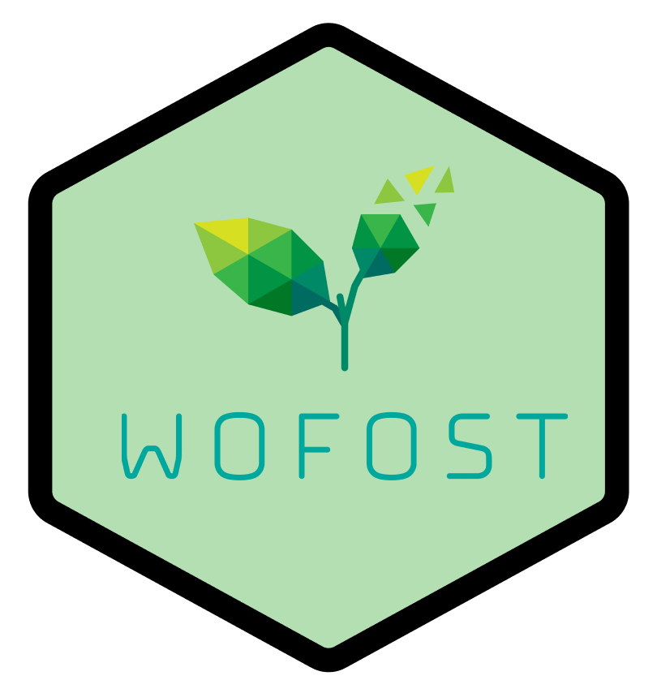

<!-- ALL-CONTRIBUTORS-BADGE:START - Do not remove or modify this section -->
[](#contributors-)
<!-- ALL-CONTRIBUTORS-BADGE:END -->
<h1 align="center">
  <br>
  <a href="http://www.amitmerchant.com/electron-markdownify"></a>
  <br>
  Crop Simulation Bot
  <br>
</h1>

<h4 align="center">Modeling crop yield with Telegram and <a href="https://pcse.readthedocs.io/en/stable/" target="_blank">WOFOST </a> simulation model.</h4>


<p align="center">


<a href="https://github.com/mishagrol/CropBot/issues" target="_blank">
    
</a>


<a href="https://github.com/mishagrol/CropBot/blob/main/LICENSE" target="_blank">
    
</a>


<p align="center">
  <a href="#about">About</a> •
  <a href="#how-to-use">How To Use</a> •
  <a href="#credits">Credits</a> •
  <a href="#license">License</a>
</p>


## About

Crop simulation software is often too complicated for many farmers to use. The main issues include collecting and formatting input data for modeling, as well as the complexity of operating the software and choosing modeling scenarios. To make this technology more accessible, we suggest combining crop simulation software with chatbot technology. We demonstrate this approach by integrating the WOFOST model into a Telegram chatbot for easy crop yield modeling.


<p align="center">


</p>


## How To Use

### 1. Register  bot

 Register your bot in Telegram and get a token.

* To register a new bot, launch the BotFather bot and send the command: `/newbot`

* In the name field, specify the name of the bot being created, for example, `Crop Bot`. This name will be seen by users when communicating with the bot.

* In the username field, specify the username of the bot being created, for example `Crop_bot`. By user name, you will be able to find the bot in Telegram. The user name must end in `...Bot` or `..._bot`.

* As a result, you will receive a token. Save it, it will be needed in the future.

* Install the icon for the bot — the `logo.png` file. Send the BotFather bot the command: `/setuserpic`

### 2. Run bot on your server

```bash
# Clone this repository
$ git clone https://github.com/mishagrol/CropBot.git

# Go into the repository
$ cd CropBot

# Save your bot token in file 
$ echo '{"bot_token": "token"}' > .token.json 

# Run the bot
$ bash rollout.sh
```

> **Note**
> Install Docker to your laptop or server before start bot


## Credits

This software uses the following open source packages:

- [AioGram](https://github.com/aiogram/aiogram)
- [PCSE/WOFOST](https://pcse.readthedocs.io/en/stable/)
- [NASA POWER](https://power.larc.nasa.gov/)
- [SoilGrids](https://soilgrids.org/)

## Related

[Py_DSSATTools](https://github.com/daquinterop/Py_DSSATTools) - python tools for DSSAT model


## License

MIT

## Contact

Mail - Mikhail.Gasanov[a]skoltech.ru

---
## Contributors ✨

Thanks goes to these wonderful people ([emoji key](https://allcontributors.org/docs/en/emoji-key)):

<!-- ALL-CONTRIBUTORS-LIST:START - Do not remove or modify this section -->
<!-- prettier-ignore-start -->
<!-- markdownlint-disable -->
<table>
  <tbody>
    <tr>
      <td align="center" valign="top" width="14.28%"><a href="https://github.com/tzoiker"><br /><sub><b>Nikitin Artyom</b></sub></a><br /><a href="https://github.com/mishagrol/CropBot/commits?author=tzoiker" title="Tests">⚠️</a> <a href="https://github.com/mishagrol/CropBot/commits?author=tzoiker" title="Code">💻</a></td>
      <td align="center" valign="top" width="14.28%"><a href="https://github.com/matseralex"><br /><sub><b>matseralex</b></sub></a><br /><a href="#mentoring-matseralex" title="Mentoring">🧑‍🏫</a> <a href="#ideas-matseralex" title="Ideas, Planning, & Feedback">🤔</a></td>
      <td align="center" valign="top" width="14.28%"><a href="https://github.com/petrovskaia"><br /><sub><b>Anna Petrovskaia</b></sub></a><br /><a href="#design-petrovskaia" title="Design">🎨</a> <a href="#research-petrovskaia" title="Research">🔬</a></td>
      <td align="center" valign="top" width="14.28%"><a href="http://evgps.tech"><br /><sub><b>Evgeny Ponomarev</b></sub></a><br /><a href="https://github.com/mishagrol/CropBot/commits?author=evgps" title="Code">💻</a> <a href="#infra-evgps" title="Infrastructure (Hosting, Build-Tools, etc)">🚇</a></td>
    </tr>
  </tbody>
</table>

<!-- markdownlint-restore -->
<!-- prettier-ignore-end -->

<!-- ALL-CONTRIBUTORS-LIST:END -->

This project follows the [all-contributors](https://github.com/all-contributors/all-contributors) specification. Contributions of any kind welcome!
